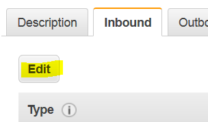
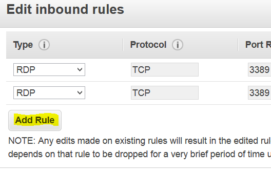

# Applying new IPs to an existing Security Group

Login to UE2S AWS (TTE-DEV) and click EC2

Click Instances

Search for your instance in the list, and click the radio button beside it. This
example uses “DAX-Vanilla”

At the bottom, click on the desired security group, beside “Security groups”. Do
not modify “default”.

Click Inbound

Click Edit

Click Add Rule

Use the dropdown in the Type column on the left to select RDP, HTTPS, SSH, or
whatever service you need. You can also select Custom if you need to allow a
non-Standard port.

In the Source column, use the dropdown to select My IP. This will automatically
select the IP you are using at the time. To add more IPs, click Add Rule again,
then in the Source column choose Custom and enter individual IPs, or a range of
IPs. You can add as many as you need, but are **strongly suggested to specify
IPs, rather than leaving open to the world / anywhere / 0.0.0.0. Leaving it
open, especially with a Windows host, will almost guarantee it gets attacked.**

Click Save at the bottom right when you have added all the necessary IPs.

Launch Remote Desktop, (or Putty / SSH) and access your host as you have before.

\*\*\*\*Note: IPs are often dynamic, sometimes changing from day to day, so if
you attempt RDP/SSH and cannot connect, you may need to update the IP list with
your new/current IP.
